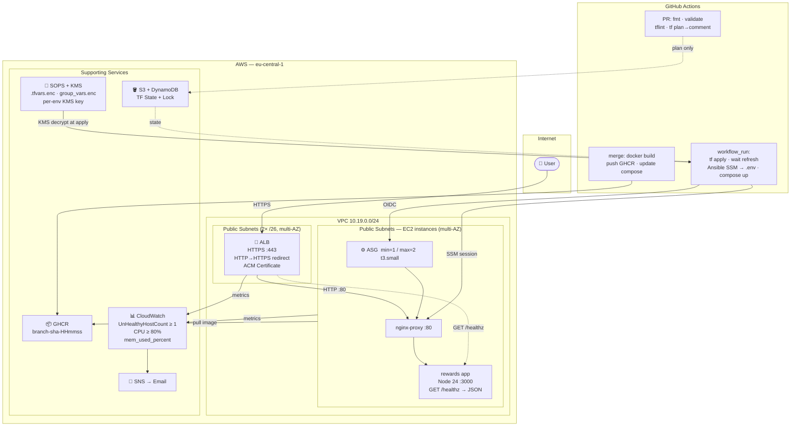

# SOLUTION.md — Rewards Dev Web Tier

## Architecture Overview

A single-environment, multi-AZ web tier in **eu-central-1** serving the `rewards` service.

**Request path:** User → ALB (HTTPS :443, ACM cert, HTTP→HTTPS redirect) → nginx-proxy (:80) → rewards app (Node 24, :3000).

**Compute:** EC2 Auto Scaling Group (`min=1 / max=2`, `t3.small`) spread across 2 public `/26` subnets — no AZ pinning, no NAT gateway. Docker Compose runs nginx-proxy + the rewards container on each instance.

**Networking:** VPC `10.19.0.0/24` split into 4× `/26` subnets (2 public used, 2 private reserved). IGW attached; instances have public IPs. Security groups allow only ALB → instance traffic on port 80; no inbound port 22. Instances are in public subnets because the Terraform OIDC role lacked `ec2:CreateNatGateway` and `ec2:AllocateAddress` permissions — private subnets with a NAT Gateway were not possible under these constraints. In prod, scope the Terraform role correctly and move instances to private subnets behind a NAT Gateway.

**Instance access:** SSM Session Manager only — Ansible connects via `aws ssm start-session`, no SSH keys on instances.

**Secrets:** Encrypted with **SOPS + AWS KMS** (one KMS key per environment). `.tfvars` and Ansible `group_vars` are committed as ciphertext; the `carlpett/sops` Terraform provider and `community.sops.load_vars` Ansible plugin decrypt at runtime using the CI role's KMS `Decrypt` permission. Decrypted values are passed through the module chain into the launch template user-data, which writes `/opt/app/.env` on first boot. No plaintext secrets in the repo, state, or CI variables.

> **Current state:** The working implementation uses SSM Parameter Store `data` sources as a pragmatic stand-in. Migration to SOPS is the next step (see Known Issues).

**CI/CD pipeline:**
1. **PR opened** → `fmt`, `validate`, `tflint`, `terraform plan` result posted as PR comment.
2. **Merge to main** → Docker image built, tagged `branch-sha-HHmmss`, pushed to GHCR, `docker-compose-dev.yaml` updated in-repo.
3. **`workflow_run` (on build success)** → `terraform apply`, ASG refresh waits for healthy instances, Ansible over SSM writes `.env` and runs `docker compose up -d`.

**Observability:** CloudWatch alarms on `UnHealthyHostCount ≥ 1` and `CPUUtilization ≥ 80%` → SNS email. `mem_used_percent` collected via CloudWatch Agent.

---




---

## Key Decisions

| Concern       | Choice                                                                        | Trade-off                                                       |
|---------------|-------------------------------------------------------------------------------|-----------------------------------------------------------------|
| State         | S3 + DynamoDB lock                                                            | Simple, team-safe; Terraform Cloud adds UI/RBAC but extra SaaS |
| Compute       | EC2 ASG + ALB, **public** subnets (no NAT)                                    | Terraform role lacked `ec2:CreateNatGateway`/`AllocateAddress`; move to private subnets in prod |
| Access        | SSM Session Manager — no port 22                                              | No key rotation, full audit trail in CloudTrail                 |
| Secrets       | SOPS + AWS KMS → `.tfvars.enc` / `group_vars.enc` → launch template → `/opt/app/.env` | Ciphertext in repo; KMS key per env; no SSM dependency  |
| Observability | CW alarms: `UnHealthyHostCount ≥ 1` + `CPUUtilization ≥ 80%` → SNS email    | Required path; add Prometheus/Grafana for prod                  |
| Tags          | `merge(var.tags, { Environment })` on every resource                          | `Service=rewards, Owner=candidate, CostCenter=payments`         |
| CI            | PR → fmt/validate/tflint/plan comment; merge → build+push; `workflow_run` deploy | Fully automated, no manual steps on merge                   |

---

## Promotion to Prod

1. Copy `terraform/health-dev-aws-eu/` → `terraform/health-prod-aws-eu/`, update `backend.tfvars` and `main.tfvars`.
2. Create a `prod` GitHub Actions environment with separate OIDC roles (trust policy scoped to `environment:prod`).
3. Add a `prod` matrix entry to `pr-checks.yml` (plan only).
4. Trigger prod deploy via `workflow_dispatch` with manual approval reviewer on the `prod` environment.

Dev and prod use separate S3 state keys/buckets and separate AWS IAM roles — no shared credentials.

---

## Blue/Green AMI Deployment

The module is already wired for blue/green. Each entry in `golden_amis` (in `main.tfvars`) produces an independent Packer AMI + ASG + Target Group. The ALB HTTPS listener forwards to whichever entry has `active = true`. Traffic cutover is a single `terraform apply`.

**Step 1 — bake the new AMI alongside the current one**

Add a second entry to `golden_amis` with the new install script and `active = false`:

```hcl
golden_amis = {
  "golden-ami-al2023-app-v1" = {   # ← currently live (blue)
    script_name = "install.sh"
    active      = true
    asg_name    = "frontend-2026-08"
  }
  "golden-ami-al2023-app-v2" = {   # ← new build (green)
    script_name = "install-v2.sh"
    active      = false
    asg_name    = "frontend-2026-09"
  }
}
```

`terraform apply` — Packer builds the v2 AMI, creates its ASG + TG and waits for healthy instances. Blue ASG is untouched; ALB still routes to blue.

**Step 2 — cut over to green**

Flip the `active` flags:

```hcl
  "golden-ami-al2023-app-v1" = { ..., active = false, ... }
  "golden-ami-al2023-app-v2" = { ..., active = true,  ... }
```

`terraform apply` — ALB listener `default_action` switches to the green target group. Zero downtime: ALB drains existing connections from blue before switching.

**Step 3 — remove blue**

Once green is confirmed healthy, delete the v1 entry from `golden_amis` and run `terraform apply`. Blue ASG, launch template, TG, IAM role, and alarms are destroyed cleanly.

**Rollback** — if green is bad before step 3, flip `active` back to v1 and `terraform apply`. Blue ASG is still running and healthy; rollback takes one apply cycle (~30 s).

---

## Known Issues & Fixes

### 1. Migrate SSM → SOPS
Current implementation uses `aws_ssm_parameter` data sources. To match the design intent, replace with SOPS-encrypted files:
- Create one KMS key per environment; grant the CI OIDC role `kms:Decrypt`.
- Encrypt `main.tfvars` in-place: `sops --encrypt --kms <key-arn> main.tfvars > main.tfvars.enc`.
- Add `carlpett/sops` provider; replace `data "aws_ssm_parameter"` blocks with `data "sops_file"`.
- Encrypt Ansible `group_vars/dev.yml`; use `community.sops.load_vars` in the playbook.
- Delete the SSM parameters and remove the `aws:ssm:GetParameter` IAM permissions.

### 2. Compose drift between deploys
Anyone with SSM access can run `docker compose up -d` on the instance with a different image, or manually edit the compose file on disk. The Ansible playbook's `recreate: always` reconciles this on every deploy, and a pre-deploy drift check now logs a `DRIFT DETECTED` warning when the running image differs from the compose file — but drift is **invisible between deploy runs**.

**Fix:** Schedule periodic reconciliation with an EventBridge rule (e.g. every 15 min) that triggers an SSM Run Command document running `docker compose -f /opt/app/docker-compose.yaml up -d --no-build`. No new infrastructure needed — SSM Run Command targets instances by tag (`Environment=dev`). Alternatively, replace the file-based compose pattern with ECR image immutability + a forced pull cron on the instance.

### 3. AMI manifest.json missing on first run
`ami_manifest.json` doesn't exist on a clean clone, causing `local.ami_id = null` and a cryptic Terraform error. **Fix:** add a `precondition` on the module output:
```hcl
precondition {
  condition     = local.ami_id != null
  error_message = "Run packer build before terraform apply."
}
```
Or decouple: run `packer build` as a standalone CI step before `terraform apply` and pass the AMI ID as a variable.

### 4. Terraform OIDC role uses `AdministratorAccess`
The `dev-terraform` GitHub Actions role has `AdministratorAccess`. **Fix:** replace with a custom policy scoped to the exact AWS services Terraform manages (EC2, VPC, ELB, ASG, IAM role/policy/attachment — with `iam:PassRole` scoped to the EC2 instance role ARN only — S3, DynamoDB, SSM, CloudWatch, SNS, ACM). Use [IAM Access Analyzer policy generation](https://docs.aws.amazon.com/IAM/latest/UserGuide/access-analyzer-policy-generation.html) against a real apply run to capture the minimal action set, then deny `iam:CreateUser`, `iam:CreateAccessKey`, and `iam:AttachUserPolicy` explicitly.

### 5. Python 3.13 breaks cloud-init
Setting `python3` system alternative to 3.13 breaks AL2023 cloud-init (compiled for 3.9). **Fix:** install 3.13 as a parallel interpreter only — never run `alternatives --set python3`. Pin `ansible_python_interpreter: /usr/bin/python3.13` in `group_vars`.

### 6. TODO — environment scaffolding script
Promoting to a new environment (prod, int, staging) currently requires manually copying `terraform/health-dev-aws-eu/`, editing `backend.tfvars`, `main.tfvars`, and updating `docker-compose-dev.yaml` by hand — error-prone and easy to miss values.

**Planned:** a Python CLI (`scripts/scaffold_env.py`) that prompts for or accepts CLI args for all environment-specific values and writes the full set of files:

```
scripts/scaffold_env.py --env prod --region eu-west-1 \
  --cidr 10.20.0.0/24 \
  --domain healthcheck-app.prod.example.com \
  --alarm-email ops@example.com \
  --github-repo myorg/myrepo
```

Outputs generated:
- `terraform/health-{env}-aws-{region}/backend.tfvars` — bucket name, key, region, DynamoDB table
- `terraform/health-{env}-aws-{region}/main.tfvars` — all variables including `golden_amis`, `github_oidc_roles`, tags
- `docker-compose-{env}.yaml` — copied from dev template with env substitutions
- `.github/workflows/` matrix entry hint printed to stdout

The script should validate CIDR non-overlap against existing environments and fail fast if an environment directory already exists.

---

## Clean-up

```bash
cd terraform/health-dev-aws-eu
AWS_PROFILE=mc NO_PROXY="*" terraform destroy -var-file=main.tfvars

# Deregister Packer AMIs
AWS_PROFILE=mc aws ec2 describe-images --owners self \
  --filters "Name=tag:ManagedBy,Values=packer" \
  --query "Images[*].ImageId" --output text | \
  xargs -n1 aws ec2 deregister-image --image-id

# Destroy state backend last
cd terraform/health-dev-aws-eu/remote-state
AWS_PROFILE=mc NO_PROXY="*" terraform destroy
```

**Estimated cost (dev):** ALB ~$18 + 1× t3.small ~$12 + misc < $2 = **~$32/month**

